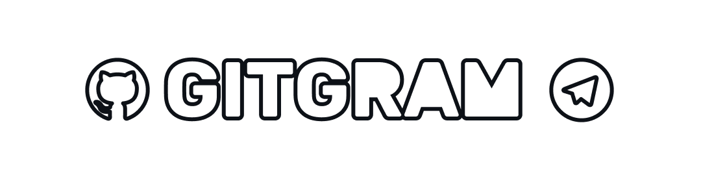

<kbd>



</kbd>

# Gitgram

GitHub notifications for Telegram

## Backstory

Gitgram was created because our team at that time was working on a big project, and we use Telegram to discuss the
project. We needed something to receive Github webhook notifications and send them to the Telegram group to ease our
communication without having to check directly on Github. Therefore, a bot was created.

## Features

It sends every notification to the group within these events:

- deployment status
- issue
- issue comment
- ping
- pull request
- pull request reviews
- release
- vulnerability alerts

## Usage

### From official Docker image

The easiest setup would be pulling from the official Docker image.

```sh
docker run \
  -e WEBHOOK_SECRET="your-webhook-secret" \
  -e BOT_TOKEN="your-bot-token" \
  -e HOME_GROUP="your-home-group" \
  -e IGNORE_PRIVATE_REPOSITORY=false \
  -p 3000:3000 \
  ghcr.io/teknologi-umum/gitgram:edge
```

Another example of running Gitgram through Docker Compose is available on our
[infrastructure repository](https://github.com/teknologi-umum/infrastructure/blob/master/gitgram/docker-compose.yml).

### From Docker

If you don't trust the official Docker image, you can always build the image yourself.

```sh
git clone https://github.com/teknologi-umum/gitgram.git
cd gitgram
docker build -t gitgram:latest .
docker run -d -p 3000:3000 --name gitgram gitgram:latest
```

Don't forget to supply your own environment variables.

### From source

First you will need to clone this repo

```sh
git clone https://github.com/teknologi-umum/gitgram.git
```

and then install all of its dependencies

```bash
pnpm install
```

To make the bot work properly, you will need these environment variables.

- `NODE_ENV`
  Used for NodeJS to determine whether the bot is running in production or development.
- `PORT`
  Which port to run the HTTP server.
- `WEBHOOK_SECRET`
  Your webhook secret. You should see it when you create your Github webhook.
- `BOT_TOKEN`
  Your telegram bot token.
- `DEV_PROXY_URL`
  Webhook proxy URL used for easier development process.
- `HOME_GROUP` (Optional)
  Default group if the repository was not found on the mapping.
- `IGNORE_PRIVATE_REPOSITORY` (Optional)
  Set to anything other than empty to make it ignore every notification from private repository.

Example:

```ini
NODE_ENV=development
PORT=3000
WEBHOOK_SECRET=123456789
BOT_TOKEN=xyzx:isyelacuapwodncnmzdcmajwo
DEV_PROXY_URL=web.com/duffUGHIUGsdsd
```

If you don't know how to make a Telegram bot and get its token, you can refer
to [Telegram Bot Documentation](https://core.telegram.org/bots)

If you don't know how to make a webhook for Github, you can visit
[GitHub Webhook Documentation](https://docs.github.com/en/developers/webhooks-and-events/webhooks/about-webhooks)

Build the bot with `pnpm run build`

Then run the bot with `pnpm run start`

## License

```
Gitgram is a bot send Github notifications to Telegram.
Copyright (C) 2021-present  Teknologi Umum Gitgram contributors

This program is free software: you can redistribute it and/or modify
it under the terms of the GNU General Public License as published by
the Free Software Foundation, either version 3 of the License, or
(at your option) any later version.

This program is distributed in the hope that it will be useful,
but WITHOUT ANY WARRANTY; without even the implied warranty of
MERCHANTABILITY or FITNESS FOR A PARTICULAR PURPOSE.  See the
GNU General Public License for more details.

You should have received a copy of the GNU General Public License
along with this program.  If not, see <https://www.gnu.org/licenses/>.
```

See [full license](./LICENSE).
